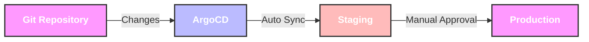
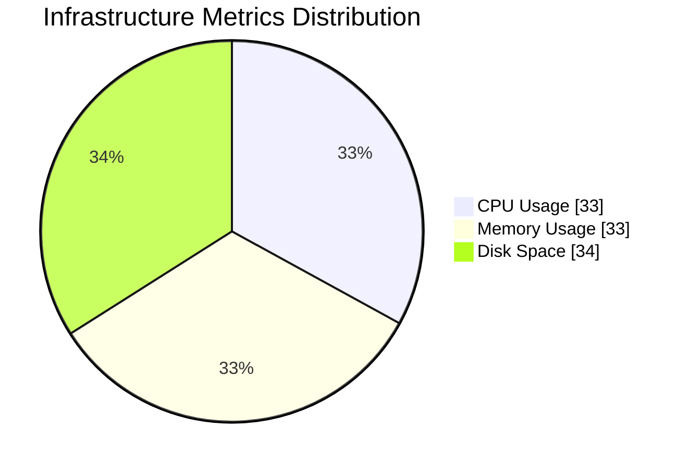
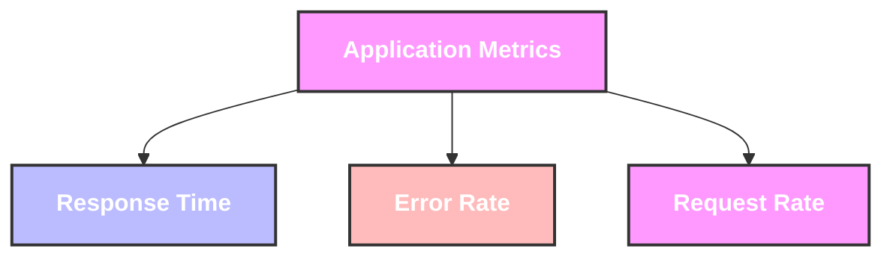
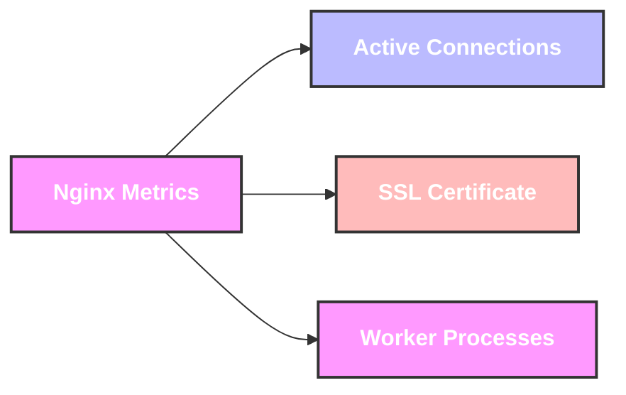

# Minikube ArgoCD Local Development Environment

A local development environment that sets up Minikube with ArgoCD for GitOps-based deployments. This project provides a complete local Kubernetes environment with automated deployment workflows using ArgoCD.

# Table of Contents
- [Project Overview](#project-overview)
  - [Prerequisites](#prerequisites)
  - [Quick Start](#quick-start)
  - [Project Structure](#project-structure)
- [Deployment Workflow](#deployment-workflow)
  - [Deployment Flow](#deployment-flow)
  - [Deployments with ArgoCD](#deployments-with-argocd)
    - [Initial Deployment](#initial-deployment)
    - [Making Changes](#making-changes)
    - [Promoting to Production](#promoting-to-production)
- [Monitoring and Observability](#monitoring-and-observability)
  - [Infrastructure Metrics Overview](#infrastructure-metrics-overview)
  - [Application Metrics Overview](#application-metrics-overview)
  - [Nginx-Specific Metrics](#nginx-specific-metrics)
- [Maintenance](#maintenance)
  - [Cleanup Instructions](#cleanup-instructions)
  - [Troubleshooting](#troubleshooting)
  - [Known Issues and Limitations](#known-issues-and-limitations)

# Project Overview

This project sets up a local Kubernetes environment using Minikube and ArgoCD for GitOps-based deployments. It includes:

- Local Kubernetes cluster using Minikube.
- ArgoCD for GitOps-based deployments.
- Terraform for infrastructure provisioning.
- Nginx example application with staging and production environments.
- Monitoring and observability setup.

## Prerequisites
- macOS (this setup is currently only working on macOS).
- Docker installed and running.
- Internet connection.
- GitHub account.
- MiniKube has to be either installed or properly uninstalled, otherwise installation will fail.
- Following binaries installed:
   - terraform (latest).
   - kubectl (latest).
   - helm (latest).

## Quick Start
Run this single command to install and configure everything:

```bash
./install.sh
```

## Project Structure
```
.
├── gitops/          # GitOps manifests for ArgoCD.
│   └── nginx/       # Nginx application manifests.
├── scripts/         # Installation scripts.
├── terraform/       # Infrastructure as Code.
└── install.sh       # Main installation script.
```

# Deployment Workflow

## Deployment Flow


## Deployments with ArgoCD
ArgoCD automatically syncs your Git repository with your Kubernetes clusters. Here's how to manage deployments:

### Initial Deployment
1. Applications are defined in `gitops/nginx/nginx-staging-app.yaml` and `nginx-production-app.yaml`.
2. ArgoCD watches these manifests and automatically deploys to the respective environments.
3. Changes are deployed first to staging, then promoted to production if manual approval is executed.

### Making Changes
1. Modify the Helm values in `gitops/nginx/custom-values.yaml`.
2. Commit and push changes to Git - trunk.
3. ArgoCD will automatically detect and apply the changes to staging (checking in every 3mins).
4. Monitor the deployment in the ArgoCD UI  (installation log will print out about how to connect to ArgoCD).

### How to check changes
Given that this k8s deployment is on NodePort, you would need to forward the port
or do something similar in a different way.

The standard way to test changes would be:

#### Test in Stage
Run this on one terminal:
```bash
kubectl port-forward svc/nginx-staging 8081:80 -n external-staging
```
Run a test on a second terminal:
```bash
curl http://localhost:8081
```
#### Test in Prod
Verify that changes were approved via ArgoCD UI.!!

Then run this on one terminal:
```bash
kubectl port-forward svc/nginx-production 8082:80 -n external-production
```
Run a test on a second terminal:
```bash
curl http://localhost:8082
```

### Promoting to Production
1. After testing in staging, manual approve to deploy to production.
2. Monitor the promotion in ArgoCD UI.
3. Verify the changes in production environment.

# Monitoring and Observability

## Infrastructure Metrics Overview


### CPU Usage
- **What**: Average CPU utilization across nodes.
- **Threshold**: Alert when > 80% for 5 minutes.
- **Importance**: High CPU usage can lead to degraded performance and potential service disruptions.
- **How to Monitor**: Use `kubectl top nodes` or Prometheus metrics.

### Memory Usage
- **What**: Available memory per node.
- **Threshold**: Alert when > 85% utilized for 5 minutes.
- **Importance**: Memory exhaustion can cause pod evictions and system instability.
- **How to Monitor**: Use `kubectl top nodes` or Prometheus metrics.

### Disk Space
- **What**: Available disk space on nodes.
- **Threshold**: Alert when > 85% full.
- **Importance**: Running out of disk space can crash nodes and corrupt data.
- **How to Monitor**: Use `kubectl describe nodes` or Prometheus metrics.

## Application Metrics Overview


### Response Time
- **What**: Average HTTP response time.
- **Threshold**: Alert when > 2 seconds over 5 minute period.
- **Importance**: Indicates user experience and potential bottlenecks.
- **How to Monitor**: Use Nginx metrics or Prometheus.

### Error Rate
- **What**: HTTP 5xx errors.
- **Threshold**: Alert when > 1% of requests over 5 minutes.
- **Importance**: Shows system stability and reliability issues.
- **How to Monitor**: Use Nginx metrics or Prometheus.

### Request Rate
- **What**: Incoming HTTP requests per second.
- **Threshold**: Alert when > 1000 rps or < 10 rps.
- **Importance**: Unusual traffic patterns may indicate issues or attacks.
- **How to Monitor**: Use Nginx metrics or Prometheus.

## Nginx-Specific Metrics


### Active Connections
- **What**: Number of active connections to Nginx.
- **Threshold**: Alert when > 10,000 connections.
- **Importance**: High connection count may indicate resource exhaustion.
- **How to Monitor**: Use Nginx status page or Prometheus.

### SSL Certificate Expiry
- **What**: Days until SSL certificate expiration.
- **Threshold**: Alert when < 30 days to expiry.
- **Importance**: Expired certificates cause service outages.
- **How to Monitor**: Use cert-manager or custom scripts.

### Worker Process Status
- **What**: Number of worker processes.
- **Threshold**: Alert when < configured minimum workers.
- **Importance**: Too few workers impacts performance and availability.
- **How to Monitor**: Use Nginx status page or Prometheus.

# Maintenance

## Cleanup Instructions

To completely remove the local development environment, run (careful!):

```bash
minikube stop
minikube delete --all --purge
brew uninstall minikube
sudo rm -f /usr/local/bin/minikube
rm -rf ~/.minikube
```

## Troubleshooting

### Common Issues

#### Installation Issues
1. **Minikube fails to start**
   - Solution: Ensure Docker is running and has enough resources.
   - Command: `minikube delete && minikube start --driver=docker`

2. **ArgoCD installation fails**
   - Solution: Check namespace and CRDs.
   - Command: `kubectl get crds | grep argoproj`

3. **Terraform apply fails**
   - Solution: Check credentials and state.
   - Command: `terraform init -reconfigure`

#### Deployment Issues
1. **Pods not starting**
   - Check pod status: `kubectl get pods -n <namespace>`
   - Check pod logs: `kubectl logs <pod-name> -n <namespace>`

2. **Services not accessible**
   - Check service status: `kubectl get svc -n <namespace>`
   - Check endpoints: `kubectl get endpoints -n <namespace>`

3. **ArgoCD sync issues**
   - Check application status: `kubectl get applications -n argocd`
   - Check sync status: `kubectl get applicationsets -n argocd`

## Known Issues and Limitations
- Installation script currently only works on macOS/arm64.
- Tools require manual installation on non-macOS systems.
- Installation script uses fixed sleep times instead of proper status checks.
- ArgoCD workloads are deployed outside Terraform, as that was stated in the requirements. It makes sense to keep it in Terraform.
- Limited amount of time (4h) to get this exercise completed.
- Typical timeouts from golang, so ended up downloading helms locally.  
