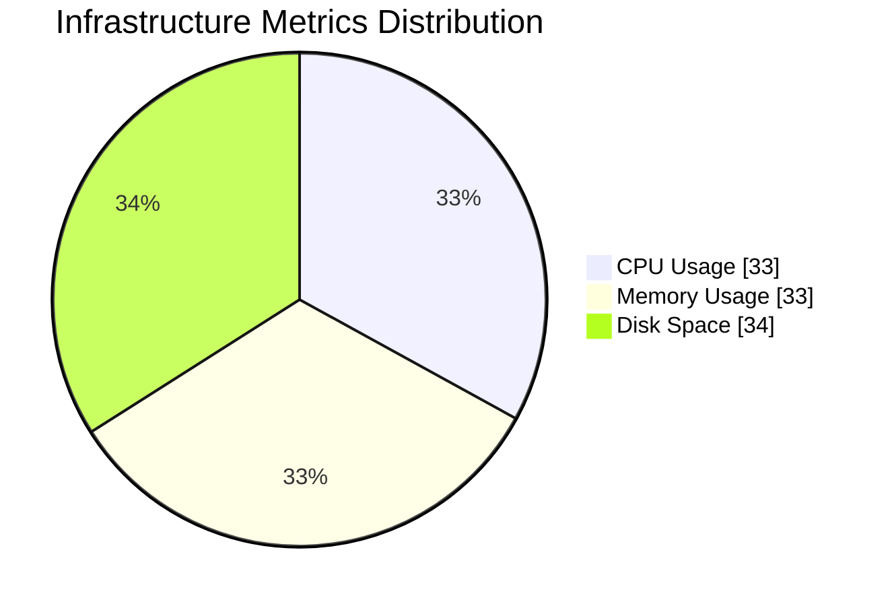
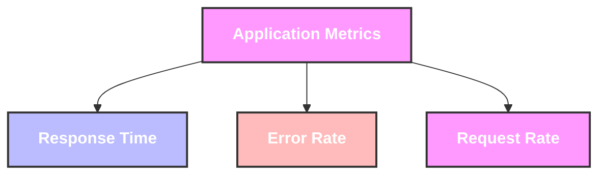
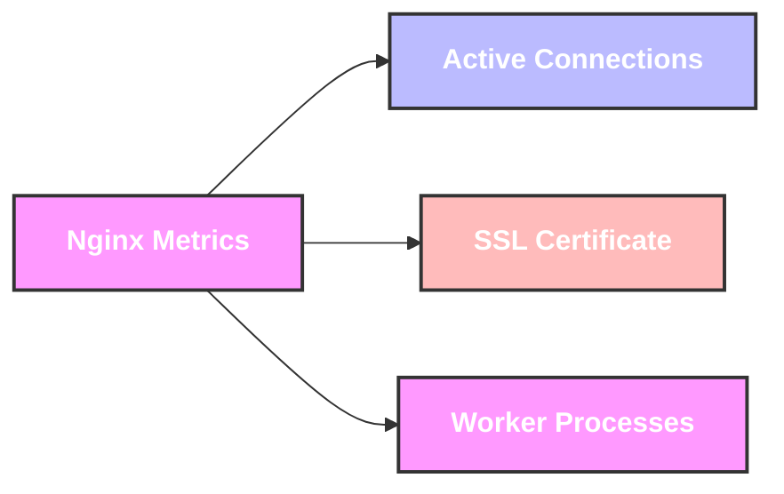

# Table of Contents
- [Install instructions](#install-instructions)
  - [Prerequisites](#prerequisites)
  - [Quick Start](#quick-start)
- [How to use ArgoCD for deployments, promotions, and rollbacks](#how-to-use-argocd-for-deployments-promotions-and-rollbacks)
  - [Deployment Flow](#deployment-flow)
  - [Deployments with ArgoCD](#deployments-with-argocd)
    - [Initial Deployment](#initial-deployment)
    - [Making Changes](#making-changes)
    - [Promoting to Production](#promoting-to-production)
- [Monitoring Metrics and Thresholds](#monitoring-metrics-and-thresholds)
  - [Infrastructure Metrics Overview](#infrastructure-metrics-overview)


# Install instructions
## Prerequisites
- macOS (this setup is currently only working on macOS)
- Internet connection
- GitHub account

## Quick Start
Run this single command to install and configure everything:

```bash
./install.sh
```

# How to use ArgoCD for deployments, promotions, and rollbacks

## Deployment Flow


## Deployments with ArgoCD
ArgoCD automatically syncs your Git repository with your Kubernetes clusters. Here's how to manage deployments:

### Initial Deployment
1. Applications are defined in `gitops/nginx/nginx-staging-app.yaml` and `nginx-production-app.yaml`
2. ArgoCD watches these manifests and automatically deploys to the respective environments
3. Changes are deployed first to staging, then promoted to production if manual approval is executed.

### Making Changes
1. Modify the Helm values in `gitops/nginx/values.yaml`
2. Commit and push changes to Git
3. ArgoCD will automatically detect and apply the changes to staging
4. Monitor the deployment in the ArgoCD UI

### Promoting to Production
1. After testing in staging, manual approve to deploy to production

# Monitoring Metrics and Thresholds

## Infrastructure Metrics Overview


### CPU Usage
- **What**: Average CPU utilization across nodes
- **Threshold**: Alert when > 80% for 5 minutes
- **Importance**: High CPU usage can lead to degraded performance and potential service disruptions

### Memory Usage
- **What**: Available memory per node
- **Threshold**: Alert when > 85% utilized for 5 minutes
- **Importance**: Memory exhaustion can cause pod evictions and system instability

### Disk Space
- **What**: Available disk space on nodes
- **Threshold**: Alert when > 85% full
- **Importance**: Running out of disk space can crash nodes and corrupt data

## Application Metrics Overview


### Response Time
- **What**: Average HTTP response time
- **Threshold**: Alert when > 2 seconds over 5 minute period
- **Importance**: Indicates user experience and potential bottlenecks

### Error Rate
- **What**: HTTP 5xx errors
- **Threshold**: Alert when > 1% of requests over 5 minutes
- **Importance**: Shows system stability and reliability issues

### Request Rate
- **What**: Incoming HTTP requests per second
- **Threshold**: Alert when > 1000 rps or < 10 rps
- **Importance**: Unusual traffic patterns may indicate issues or attacks

## Nginx-Specific Metrics


### Active Connections
- **What**: Number of active connections to Nginx
- **Threshold**: Alert when > 10,000 connections
- **Importance**: High connection count may indicate resource exhaustion

### SSL Certificate Expiry
- **What**: Days until SSL certificate expiration
- **Threshold**: Alert when < 30 days to expiry
- **Importance**: Expired certificates cause service outages

### Worker Process Status
- **What**: Number of worker processes
- **Threshold**: Alert when < configured minimum workers
- **Importance**: Too few workers impacts performance and availability
